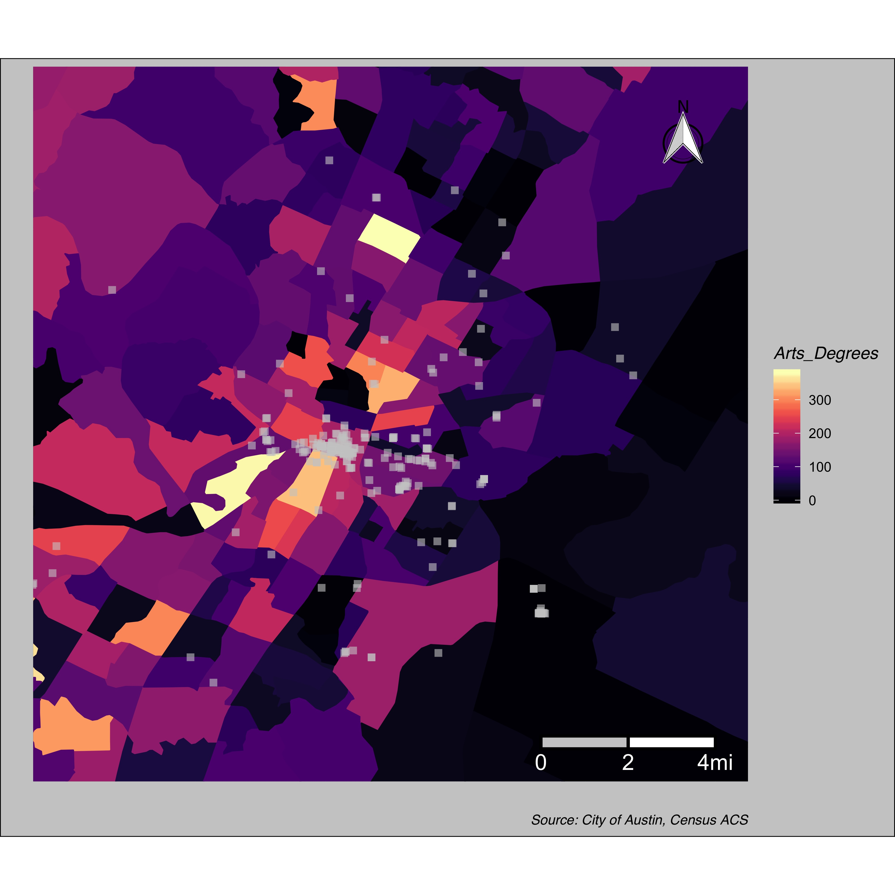

 

 

I am currently a policy analyst with the federal government based in Los Angeles. My PhD (UCLA, 2021) [dissertation](https://www.proquest.com/docview/2546904619?pq-origsite=gscholar&fromopenview=true) looked at the relationship between educational attainment and residential preferences in LA. See dissertation dashboard tab to explore some of my findings.  For more of my academic work, see the publications tab. For examples of my data visualizations, see the visualizations tab. 

 

