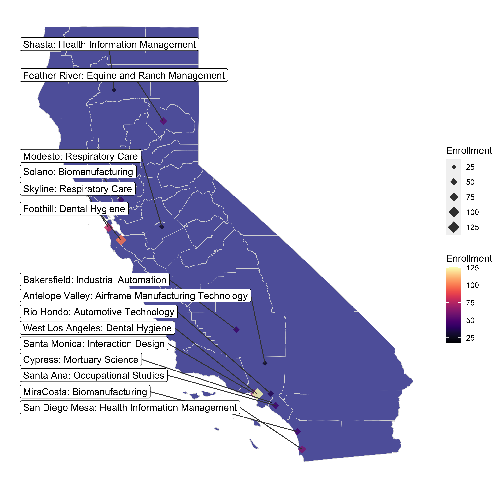

**A sample of ad-hoc data visualizations for various projects, 2019-2022.**
  
 

*California Community College Baccalaureate Pilot Programs*
 

***

*Pell Enrollment in California's Higher Education System*
 

***

*National Highway System, New Hampshire*
 

***

*Logit Model Estimates, Relationship between % Degrees and Gentrification in LA*
 

***

*Student Population Change in Berkeley, CA, 2010-2019*
 

***

*Cryptocurrency Complaints*
 

